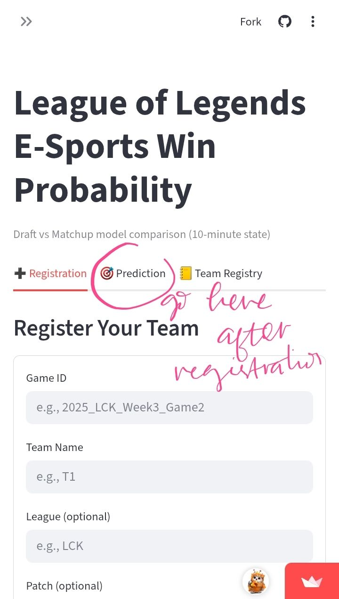

# Predicting Winning Probability League of Legends Pro Matches

## App Link
https://lolmatchprediction-boni.streamlit.app/

## Repository Outline
This repository contains the documentations process to create a classification ML model and its deployment. There are a few important files listed below: 
> 1. README.md 
> 2. notebook.ipynb, contains the data processing and ML training process. 
> 3. inference_notebook.ipynb, contains internal testing process. 
> 4. datasets: 2025_LoL_esport... dataset used for the building model. (access details: see notebook). 2026_matches... dataset that **can** be used for inference. 
> 5. requirements.txt, contains list of files needed for StreamlitApp deployment. 
> 6. deployment files, contains:
>> 6a. models, list of models used for deployments. 
>> 6b. src, contains 3 files: [1] lol_features.py, all functions related to features reconstructions. [2] prediction.py, inference in app form, for deployment. [3] streamlit_app.py, deployment app, including UI/UX. 
> 7. concept.txt, answering some conceptual problems. (ps: not exactly related to the project, but listed so this doesn't get lost.)

## Problem Identification
In professionals mathes of League of Legends (LoL), we always wonder about how deterministic is an early-game advantages; such as the champions you can choose, whether or not you have first pick, etc. Even at 10-mins park, team-heavy metrics such as cp, xp, and golds owned already mattered. Even more so when the team-opponent interaction slowly (or not that slowly) unfolding. 
The goal of this project is to quantify such problems. It will be using step-wise updating probabilty system. First, we have **intrinsic factors** on winning probabilty, it is basically predict how much early advantage a team had--or how strong they generally are with certain lineup and execution. Second, we have **matchup factors** probability, here, we focus solely on team-opponent interactions. Why? Because even if the team is strong, it is not guaranteed to win if the opponent is stronger. Hence, this type of comparison is required. 
By comparing multiple algorithm, including Logistic Regression, LightGBM, and XBoosting, I created a paralel probability for the process. By providing certain team-opponent data, we will quantify how much likely a team to win with that draft, and then how much more or less they will win against certain kind of opponents. 
Model performance is assessed using ROC-AUC, LogLoss, BrierScore, and complimeted by accuracy based metrics to ensure robust probabilistic and classifications evaluations. For details about models constructions and eliminations process, please refer to the notebook file. 

## Project Output
This project is deployed as a StreamlitApp. Here is an interactive UI where users can put in their LoL team's and opponent's data and get the winning probability rate. Other than that, a code-based inference is also accessible using the inference notebook above. 

## Data
The data is acquired from https://oracleselixir.com/tools/downloads. For this project, I only used the 2025 data. The original dataset (uploaded here as well), contains over 120k data entries including team and players stats per match. I focus on the teams stats per match only, totalling of a little of 10-thousands matches, each match is 2 teams. Final n-sampe is 20160, .5 wins. 

## Method
Our final methods chosen are: LightGBM and Logistic Regression as commonly used in a lot of high-volatility sports and e-sports. These 2 models work in sync for this project, because while the tree-based algorithm gives us a great probability for the first phase. Linear model, especially logistic regression, gives us better estimates and explainability for the match phase. 
For the draft phase, I will only be using the tree-based algorithm due to the sparsity of categorical featues. I was debating between XGBoost and LGBM, but then decided on LGBM for its stability pre-post calibration. 
On the later phase, the performances were reversed--quite expectedly. Even so, the consistency between the logreg are stronger than ever (corr=.9). For this, I will be using the two model in paralel to each other, prioritising Logistic Regression. 

## Stacks
Main programing language used here is python. For main packages used includes: pandas, numpy, matplotlib, joblib, scipy, sklearns, lightgbm, xgboost, sklearn. 

## Reference
See: https://lolmatchprediction-boni.streamlit.app/ for final result of the app. 

ps: LGBM is very... spammy, to say the least. if you want to rerun my notebook, don't complain to me when it spams you. Thou have been warned. >_<

_boni